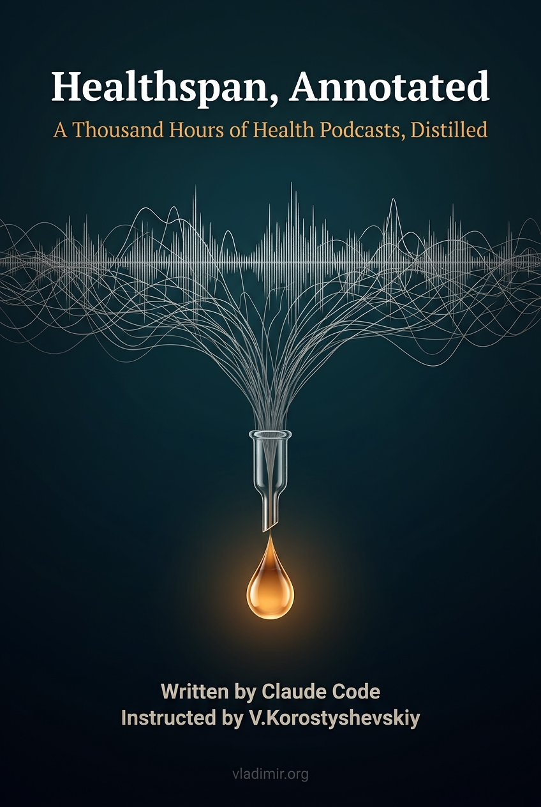

# Healthspan, Annotated

A graded survey of the healthspan and longevity field, drawn from ~8,900 videos across 13 podcast channels: Huberman, Attia, Hyman, Patrick, Greenfield, Asprey, Gundry, Brecka, Lugavere, Galpin, Lyon, Masterjohn, and Physionic. 16 chapters, roughly 89,000 words of body text, 105 glossary terms, and 1,489 endnotes running to another 57,000 words.

The editorial position is this: every empirical claim in the book traces to a specific speaker, on a specific podcast, on a specific date. Nothing factual was invented. Where the evidence is strong, the prose says so. Where it is thin, resting on one study or one speaker, the prose says that too. The book does not tell you what to take or what to do. It tells you what the field's most prominent voices actually said, and how much weight each claim can bear.

[Video overview of the project](https://www.youtube.com/watch?v=ufu54TvTwok)

## Why this exists

Health advice arrives attached to interests. A recommendation from someone who sells the supplement, runs the clinic, or has built an audience on a position is not worthless, but it cannot be taken at face value, and from the outside there is no clean way to separate the part that is evidence from the part that is inventory. Apply that suspicion one speaker at a time and you are left with nothing to read.

The alternative is to stop evaluating speakers and start evaluating claims across speakers. Thirteen shows running for years, most of them bringing in outside guests, produce a large population of people who disagree with each other in public and cite evidence at each other while doing it. Where unaffiliated speakers converge on a finding, that is worth more than any single endorsement. Where they diverge, the disagreement is itself information: it marks the edge of what is actually settled, as opposed to what is merely stated confidently.

This is not Galton's ox, and the value is not in the averaging. These thirteen channels are not a random sample of anything and not a proxy for the literature. What they are is internally adversarial: they hold incompatible positions, sell different and competing things, and correct each other in public. Agreement is cheap in a room of allies and expensive here, which is what makes convergence across them worth reading. What the group does share is a frame. Everyone in this business has an audience because intervention is interesting, so the corpus tilts toward things being actionable and effects being large, even while it fights over which things. Aggregation alone would carry that tilt straight into the text. So every claim stays attached to who said it and on what basis, then gets graded: strong where the finding is large, replicated, and echoed by speakers who share nothing but the data; thin where it rests on one practitioner or one small trial.

The idea is not mine and not new. I have always been a fan of Surowiecki's [*The Wisdom of Crowds*](https://en.wikipedia.org/wiki/The_Wisdom_of_Crowds), which sets out what a group needs before it can outperform its smartest member: diversity of opinion, independence, decentralization, and some way of pooling what everyone knows. Three of those are only partly satisfied here. The diversity is real and the decentralization is total; the independence is not, since these people read each other. But the fourth condition was the hard one, and it was hard for mechanical reasons. Pooling nine thousand videos meant watching nine thousand videos at 1x, so nobody did. That cost is what collapsed. Turning a large body of unstructured talk into structured, attributable, countable claims is now something one person can do, which is the only reason this book exists.

## How it was made

Subtitles were downloaded using [YTubeFetch](https://github.com/vkorost/ytubefetch). The resulting corpus (71,825 unique text segments from ~8,900 videos) was processed through a four-stage extraction pipeline: chunking, topic tagging, claim extraction, and consolidation into per-topic reference documents. The book was then assembled from those reference documents using a multi-agent pipeline with mechanical fact-tracing. Reference: [extraction-pipeline.md](./extraction-pipeline.md). The assembly pipeline is described in [weekend-diy-book](https://github.com/vkorost/weekend-diy-book).

## The voice

The book is narrated in first person by a constructed reader-narrator: a non-specialist who worked through the material and reports back as an equal rather than lecturing as a clinician. The narrator has no life, no history, and no body. Where the text sounds like experience, it is a way of speaking. The voice warms up around findings that are large, replicated, and echoed by independent speakers, and goes flat and skeptical around claims resting on one practitioner or one small study. That temperature shift is deliberate: read the heat of a passage as a reading of the evidence behind it. See [A Note on the Voice](./book/chapters/00b-note-on-the-voice.md) for the full explanation.

## The Channels

- [**Huberman Lab**](https://www.youtube.com/@hubermanlab) (Andrew Huberman): neuroscience, protocols, supplements
- [**The Drive**](https://www.youtube.com/@PeterAttiaMD) (Peter Attia): longevity, metabolic health, deep clinical dives
- [**The Doctor's Farmacy**](https://www.youtube.com/@drmarkhyman) (Mark Hyman): functional medicine, nutrition, gut health
- [**FoundMyFitness**](https://www.youtube.com/@FoundMyFitness) (Rhonda Patrick): micronutrients, sauna, molecular biology
- [**Ben Greenfield Life**](https://www.youtube.com/@bengreenfieldlife) (Ben Greenfield): biohacking, fitness, alternative health
- [**The Human Upgrade**](https://www.youtube.com/@DaveAspreyBPR) (Dave Asprey): biohacking, supplements, performance
- [**The Dr. Gundry Podcast**](https://www.youtube.com/@GundryMDYT) (Steven Gundry): lectins, gut health, plant paradox
- [**The Ultimate Human**](https://www.youtube.com/@ultimatehumanpodcast) (Gary Brecka): methylation, gene-based health
- [**The Genius Life**](https://www.youtube.com/@maxlugavere) (Max Lugavere): brain health, nutrition, lifestyle
- [**Andy Galpin**](https://www.youtube.com/@drandygalpin): exercise physiology, strength and conditioning
- [**Gabrielle Lyon**](https://www.youtube.com/@DrGabrielleLyon): muscle-centric medicine, protein
- [**Chris Masterjohn**](https://www.youtube.com/@chrismasterjohn): micronutrients, biochemistry
- [**Physionic**](https://www.youtube.com/@Physionic): evidence-based health, study analysis

The hosts are the entry points, not the full roster. Guests are cited on the same terms as the people who invited them, because a claim's weight comes from who made it and what stands behind it, not from whose show it aired on. Per-channel counts are in [extraction-pipeline.md](./extraction-pipeline.md).

## Structure

16 chapters across six areas, plus a [Preface](./book/chapters/00-preface.md) and a [Note on the Voice](./book/chapters/00b-note-on-the-voice.md):

- **Measurement**: [Ch 1: Measure First](./book/chapters/01-measure-first.md)
- **Movement**: [Ch 2: The Aerobic Engine](./book/chapters/02-the-aerobic-engine.md) | [Ch 3: Strength and Power](./book/chapters/03-strength-and-power.md) | [Ch 4: Movement for the Long Haul](./book/chapters/04-movement-for-the-long-haul.md)
- **Nutrition**: [Ch 5: Protein, Carbs, Fats](./book/chapters/05-protein-carbs-fats.md) | [Ch 6: Timing, Fiber, and the Rest](./book/chapters/06-timing-fiber-and-the-rest.md)
- **Sleep**: [Ch 7: Sleep](./book/chapters/07-sleep.md)
- **Cardiometabolic**: [Ch 8: Heart and Metabolism](./book/chapters/08-heart-and-metabolism.md)
- **Gut**: [Ch 9: The Gut](./book/chapters/09-the-gut.md)
- **Hormones**: [Ch 10: Hormones](./book/chapters/10-hormones.md)
- **Brain**: [Ch 11: The Brain](./book/chapters/11-the-brain.md)
- **Environment**: [Ch 12: Heat, Breath, and Light](./book/chapters/12-heat-breath-and-light.md) | [Ch 13: Air, Water, and Chemicals](./book/chapters/13-air-water-and-chemicals.md)
- **Supplements**: [Ch 14: The Supplement Shelf](./book/chapters/14-the-supplement-shelf.md)
- **AI**: [Ch 15: AI as a Health Tool](./book/chapters/15-ai-as-a-health-tool.md)
- **Skin and hair**: [Ch 16: Skin, Hair, and the Long Game](./book/chapters/16-skin-hair-and-the-long-game.md)

Chapters are self-contained and can be read in any order. [`GLOSSARY.md`](./book/GLOSSARY.md) collects every bolded term with a short definition and the chapters where it appears.

## Download

- [**PDF**](https://github.com/vkorost/healthspan-book/releases/latest/download/Healthspan-Annotated.pdf) - for offline reading and print.
- [**EPUB**](https://github.com/vkorost/healthspan-book/releases/latest/download/Healthspan-Annotated.epub) - for e-readers.

Both are attached to the [latest release](https://github.com/vkorost/healthspan-book/releases/latest) and always point at the current revision. The book is corrected in place rather than re-versioned, so these links never go stale.

## What's in this repo

- `README.md`: this file.
- [`extraction-pipeline.md`](./extraction-pipeline.md): description of the four-stage extraction pipeline used to build the source corpus.
- [`book/chapters/`](./book/chapters/): the 16 chapters plus preface and voice note as individual Markdown files, with superscript endnote markers.
- [`book/GLOSSARY.md`](./book/GLOSSARY.md): 105 specialized terms with definitions and chapter references.
- [`book/ENDNOTES.md`](./book/ENDNOTES.md): 1,489 source citations organized by chapter.

The raw subtitles, the extracted claims database, the consolidated reference documents, and the pipeline scripts are not published. Only the book and the description of the approach are here.

## Coverage cutoff

The corpus spans 2007 through 2 May 2026. Nothing published after that date is reflected. The field moves fast.

## AI assistance, scope of

Claude was used for corpus processing (tagging, claim extraction, consolidation), prose generation in a defined voice, per-chapter assembly under explicit instructions, fact-tracing, and glossary generation. Editorial decisions about which channels to include, how to organize the material, and what to emphasize were mine. No independent fact-checking or source verification beyond what is already in the corpus was performed. The pipeline enforces that every claim traces to a source; it does not verify the source against primary literature.

## What this book is not

This book is not medical advice. It is not a prescription. It is not a diet plan, a training program, or a substitute for a clinician who knows your history. It is a structured, sourced, and graded account of what the most widely followed voices in the healthspan field have said, measured against the strength of the evidence behind each claim. Consult your doctor before acting on anything you read here.

## Author

I hold no credentials in medicine, nutrition, exercise science, or any health discipline, and I have no standing to write a health book on my own authority. This book is not written on my authority. What I contributed is the part I can actually do: build the corpus, define the sourcing rules, and hold the assembly to them so that nothing enters the text without an owner. Every empirical claim here belongs to someone who does hold credentials, or to someone contesting them. My job was to keep the attribution intact and the grading honest.

## On making it public

I built this for myself. The decision to publish came later, while the book was being written, and I have no illusions about its reach. It is long, it is dense, and it asks for sustained attention across sixteen chapters. Most people who come across it will not read it. If ten people read it and it helps them, putting it here was worth doing.

## License

This repository is published for personal reading only. See [LICENSE](./LICENSE) for full terms. Commercial reproduction, redistribution, and use as AI training data are not permitted.

---

